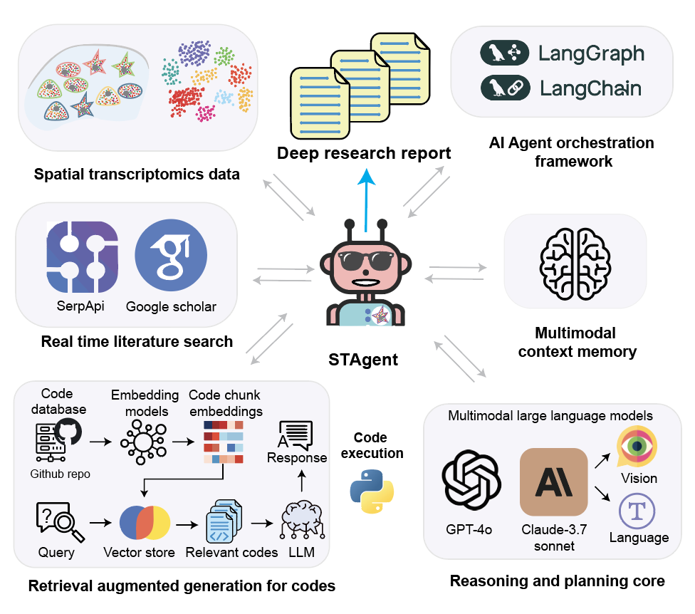

# STAgent

[](https://github.com/LiuLab-Bioelectronics-Harvard/STAgent/stargazers)
[](https://opensource.org/licenses/MIT)

https://doi.org/10.1101/2025.04.01.646731

## Overview
**STAgent** is a multimodal large language model (LLM)-based AI agent that automates spatial transcriptomics analysis from data to deep scientific insights. Built for end-to-end research autonomy, STAgent integrates:

- Advanced vision-language models
- Dynamic code generation
- Contextualized literature integration
- Structured report synthesis

STAgent streamlines complex spatial biology workflows, removing the need for manual programming or domain-specific expertise. This enables rapid, reproducible, and interpretable discoveries in tissue biology.



## Related Work

STAgent is part of a broader AI agent ecosystem we developed for specialized biological data analysis. A complementary tool in this ecosystem is [SpikeAgent](https://github.com/LiuLab-Bioelectronics-Harvard/SpikeAgent.git), which focuses on neuronal electrophysiology data. While STAgent specializes in spatial transcriptomics to reveal tissue architecture and gene expression patterns, SpikeAgent automates the analysis of neuronal firing patterns and network dynamics from electrophysiological recordings.

SpikeAgent is described in our recent preprint: [https://www.biorxiv.org/content/10.1101/2025.02.11.637754v1](https://www.biorxiv.org/content/10.1101/2025.02.11.637754v1)

## Demo

Check out our [demo video](https://www.youtube.com/watch?v=aEUop05RINY&t=2s) to see STAgent in action.

## Features

### End-to-End Automation
Transforms spatial transcriptomics data into comprehensive, publication-style research reports without human intervention. STAgent autonomously executes the full analytical pipeline from image preprocessing to biological interpretation.

### Multimodal Interaction
Supports text, voice, and image-based inputs, enabling intuitive natural language interfaces for researchers with no computational background.

### Autonomous Reasoning
Leverages multimodal LLMs to perform visual reasoning on tissue images, generate and execute Python analysis code, interpret spatial maps, and integrate literature insights.

### Interpretable Results
Produces structured scientific reports with methods, key findings, biological implications, and citation-supported context, resembling peer-reviewed publications.

### Context-Aware Gene Analysis
Performs multimodal enrichment analyses that go beyond statistical significance, focusing on biologically relevant pathways tailored to the tissue context.

### Visual Reasoning Engine
Analyzes spatial maps and cell architectures directly, detecting subtle morphogenetic patterns and tissue-level changes across timepoints or conditions.

### Scalable Knowledge Synthesis
Converts spatially resolved gene expression data into coherent scientific narratives, uncovering developmental programs, cellular interactions, and signaling networks.

## Installation

### Prerequisites
- Python 3.11
- Conda package manager

### Setup Instructions

1. **Clone the repository**
   ```bash
   git clone https://github.com/LiuLab-Bioelectronics-Harvard/STAgent.git
   cd STAgent
   ```

2. **Install dependencies**

   We use conda to manage dependencies and have tested on Mac systems with Apple M2 chips.

   ```bash
   # Create the environment from the file
   conda env create -f environment.yml
   
   # Activate the environment
   conda activate STAgent
   ```

3. **Configure environment variables**
   - modify the `.env` file (src/.env) with your own API keys:
   
   ```
   # OpenAI models (https://platform.openai.com/api-keys)
   OPENAI_API_KEY=<your-openai-api-key-here>
   WHISPER_API_KEY=<your-whisper-api-key-here>
   (Note: OPENAI_API_KEY is the same as WHISPER_API_KEY)

   # Claude models (https://www.anthropic.com/api)
   ANTHROPIC_API_KEY=<your-anthropic-api-key-here>

   # Google Scholar search via SerpAPI (https://serpapi.com/)
   SERP_API_KEY=<your-serpapi-key-here>
   ```
💡 Important: Make sure your API accounts have sufficient balance or credits available, otherwise the agent may not function properly.

4. **Set up the data folder**

   ```bash
   mkdir -p data
   ```
   
   Download the .h5ad data files from [Google Drive](https://drive.google.com/drive/folders/1RqWGBhCia06-vQnqHUnid63MybQIKwFJ) and place them in the `./data` directory.

## Usage

1. **Launch the application**
   ```bash
   streamlit run src/unified_app.py
   ```
   The app will open in your default web browser at the local host.

2. **Interact with the agent**
   - Select a model (claude-3.7-sonnet recommended)
   - You can start interacting with the agent by typing messages in the chat interface
   - Example prompts you can try:
   ```
   "Can you help me perform an end-to-end analysis on my spatial transcriptomic datasets. Please also generate a report."
   ```
   - The agent will respond to your queries and can perform complex analyses based on natural language instructions

## Project Structure

- `src/`: Contains the source code for STAgent
- `data/`: Directory for storing spatial transcriptomics datasets
- `src/tmp/plots/`: Contains plots generated by the agent
- `conversation_histories_{model}/`: Stores conversation history classified by model

## Example Output

When you prompt the agent to perform an end-to-end analysis, it generates a comprehensive markdown report with peer-reviewed literatures as references (one example output is "STAgent_generated_report.md"). 

<!-- Add example output images here when available -->

## Citation
If you use STAgent in your research, please cite:
> *Lin, Z., *Wang, W., et al. Spatial transcriptomics AI agent charts hPSC-pancreas maturation in vivo. (2025). _bioRxiv_.
> https://doi.org/10.1101/2025.04.01.646731

## License
This project is licensed under the MIT License - see the [LICENSE](LICENSE) file for details.
