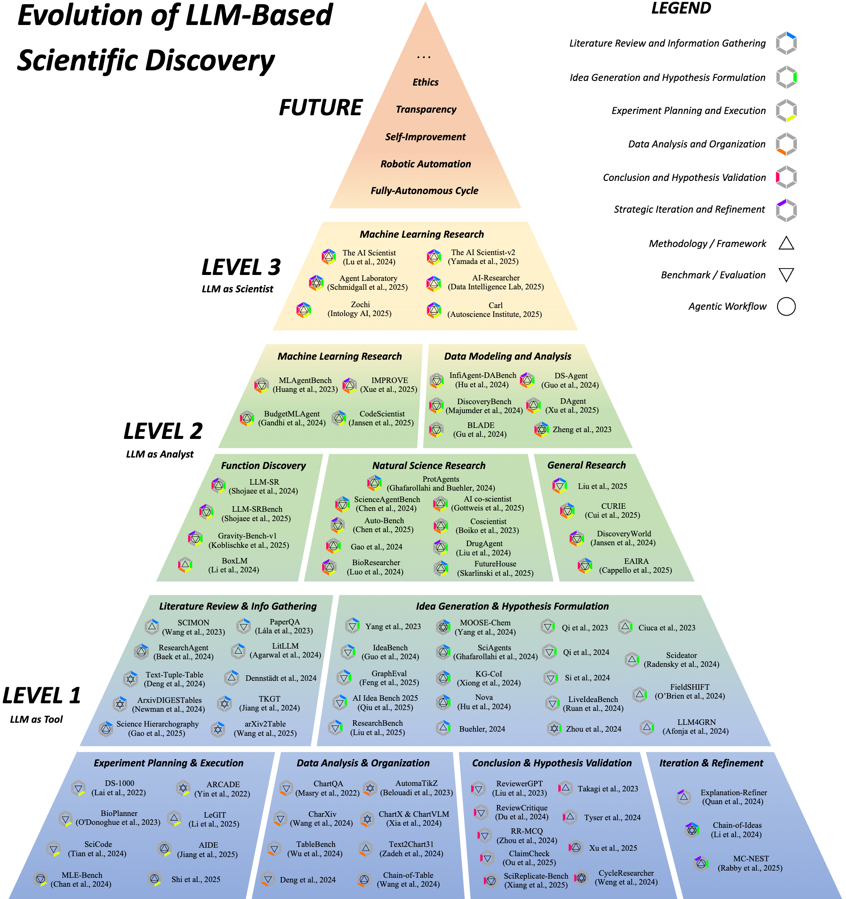

# Awesome LLM Scientific Discovery [](https://awesome.re)

A curated list of pioneering research papers, tools, and resources at the intersection of Large Language Models (LLMs) and Scientific Discovery. 

Survey: ***From Automation to Autonomy: A Survey on Large Language Models in Scientific Discovery.*** ([https://arxiv.org/abs/2505.13259])

The survey delineates the evolving role of LLMs in science through a three-level autonomy framework:
*   **Level 1: LLM as Tool:** LLMs augmenting human researchers for specific, well-defined tasks.
*   **Level 2: LLM as Analyst:** LLMs exhibiting greater autonomy in processing complex information and offering insights.
*   **Level 3: LLM as Scientist:** LLM-based systems autonomously conducting major research stages.

Below is a visual representation of this taxonomy:



We aim to provide a comprehensive overview for researchers, developers, and enthusiasts interested in this rapidly advancing field.

## Contents

*   [Level 1: LLM as Tool](#level-1-llm-as-tool)
    *   [Literature Review and Information Gathering](#literature-review-and-information-gathering)
    *   [Idea Generation and Hypothesis Formulation](#idea-generation-and-hypothesis-formulation)
    *   [Experiment Planning and Execution](#experiment-planning-and-execution)
    *   [Data Analysis and Organization](#data-analysis-and-organization)
    *   [Conclusion and Hypothesis Validation](#conclusion-and-hypothesis-validation)
    *   [Iteration and Refinement](#iteration-and-refinement)
*   [Level 2: LLM as Analyst](#level-2-llm-as-analyst)
    *   [Machine Learning Research](#machine-learning-research)
    *   [Data Modeling and Analysis](#data-modeling-and-analysis)
    *   [Function Discovery](#function-discovery)
    *   [Natural Science Research](#natural-science-research)
    *   [General Research](#general-research)
*   [Level 3: LLM as Scientist](#level-3-llm-as-scientist)
*   [Contributing](#contributing)

---

## Level 1: LLM as Tool

At this foundational level, LLMs function as tailored tools under direct human supervision, designed to execute specific, well-defined tasks within a single stage of the scientific method. Their primary goal is to enhance researcher efficiency.

### Literature Review and Information Gathering

Automating literature search, retrieval, synthesis, structuring, and organization.

*   **SCIMON : Scientific Inspiration Machines Optimized for Novelty** [](https://arxiv.org/pdf/2305.14259) - *Wang et al. (2023.05)*
*   **ResearchAgent: Iterative research idea generation over scientific literature with Large Language Models** [](https://arxiv.org/pdf/2404.07738) - *Baek et al. (2024.04)*
*   **Text-Tuple-Table: Towards Information Integration in Text-to-Table Generation via Global Tuple Extraction** [](https://arxiv.org/pdf/2404.14215) - *Deng et al. (2024.04)*
*   **TKGT: Redefinition and A New Way of text-to-table tasks based on real world demands and knowledge graphs augmented LLMs** [](https://aclanthology.org/2024.emnlp-main.901.pdf) - *Jiang et al. (2024.10)*
*   **ArxivDIGESTables: Synthesizing scientific literature into tables using language models** [](https://arxiv.org/pdf/2410.22360) - *Newman et al. (2024.10)*
*   **Can LLMs Generate Tabular Summaries of Science Papers? Rethinking the Evaluation Protocol** [](https://arxiv.org/pdf/2504.10284) - *Wang et al. (2025.04)*
*   **LitLLM: A Toolkit for Scientific Literature Review** [](https://arxiv.org/pdf/2402.01788v1) - *Agarwal et al. (2024.02)*
*   **Title and abstract screening for literature reviews using large language models: an exploratory study in the biomedical domain** [](https://systematicreviewsjournal.biomedcentral.com/articles/10.1186/s13643-024-02575-4) - *Dennstädt et al. (2024.06)*
*   **Science Hierarchography: Hierarchical Organization of Science Literature** [](https://arxiv.org/pdf/2504.13834) - *Gao et al. (2025.04)* 

### Idea Generation and Hypothesis Formulation

Automated generation of novel research ideas, conceptual insights, and testable scientific hypotheses.

*   **SciAgents: Automating scientific discovery through multi-agent intelligent graph reasoning** [](https://arxiv.org/pdf/2409.05556) - *Ghafarollahi et al. (2024.09)*
*   **Accelerating scientific discovery with generative knowledge extraction, graph-based representation, and multimodal intelligent graph reasoning** [](https://arxiv.org/pdf/2403.11996) - *Buehler (2024.03)*
*   **MOOSE-Chem: Large Language Models for Rediscovering Unseen Chemistry Scientific Hypotheses** [](https://arxiv.org/pdf/2410.07076) - *Yang et al. (2024.10)*
*   **Large Language Models for Automated Open-domain Scientific Hypotheses Discovery** [](https://arxiv.org/pdf/2309.02726) - *Yang et al. (2023.09)*
*   **Improving Scientific Hypothesis Generation with Knowledge Grounded Large Language Models** [](https://arxiv.org/pdf/2411.02382) - *Xiong et al. (2024.11)*
*   **ResearchBench: Benchmarking LLMs in Scientific Discovery via Inspiration-Based Task Decomposition** [](https://arxiv.org/pdf/2503.21248) - *Liu et al. (2025.03)*
*   **AI Idea Bench 2025: AI Research Idea Generation Benchmark** [](https://arxiv.org/pdf/2504.14191) - *Qiu et al. (2025.04)*
*   **IdeaBench: Benchmarking Large Language Models for Research Idea Generation** [](https://arxiv.org/pdf/2411.02429) - *Guo et al. (2024.11)*
*   **Can LLMs Generate Novel Research Ideas? A Large-Scale Human Study with 100+ NLP Researchers** [](https://arxiv.org/pdf/2409.04109) - *Si et al. (2024.09)*
*   **Learning to Generate Research Idea with Dynamic Control** [](https://arxiv.org/pdf/2412.14626) - *Li et al. (2024.12)*
*   **LiveIdeaBench: Evaluating LLMs' Divergent Thinking for Scientific Idea Generation with Minimal Context** [](https://arxiv.org/pdf/2412.17596) - *Ruan et al. (2024.12)*
*   **Nova: An Iterative Planning and Search Approach to Enhance Novelty and Diversity of LLM Generated Ideas** [](https://arxiv.org/pdf/2410.14255) - *Hu et al. (2024.10)*
*   **GraphEval: A Lightweight Graph-Based LLM Framework for Idea Evaluation** [](https://arxiv.org/pdf/2503.12600) - *Feng et al. (2025.03)*
*   **Hypothesis Generation with Large Language Models** [](https://arxiv.org/pdf/2404.04326) - *Zhou et al. (2024.04)*
*   **Harnessing the Power of Adversarial Prompting and Large Language Models for Robust Hypothesis Generation in Astronomy** [](https://arxiv.org/pdf/2306.11648) - *Ciuca et al. (2023.06)*
*   **Large Language Models are Zero Shot Hypothesis Proposers** [](https://arxiv.org/pdf/2311.05965) - *Qi et al. (2023.11)*
*   **Machine learning for hypothesis generation in biology and medicine: exploring the latent space of neuroscience and developmental bioelectricity** [](https://pubs.rsc.org/en/content/articlelanding/2024/dd/d3dd00185g) - *O’Brien et al. (2023.07)*
*   **Large Language Models as Biomedical Hypothesis Generators: A Comprehensive Evaluation** [](https://arxiv.org/pdf/2407.08940) - *Qi et al. (2024.07)*
*   **LLM4GRN: Discovering Causal Gene Regulatory Networks with LLMs -- Evaluation through Synthetic Data Generation** [](https://arxiv.org/pdf/2410.15828) - *Afonja et al. (2024.10)*
*   **Scideator: Human-LLM Scientific Idea Generation Grounded in Research-Paper Facet Recombination** [](https://arxiv.org/pdf/2409.14634) - *Radensky et al. (2024.09)*
*   **HypER: Literature-grounded Hypothesis Generation and Distillation with Provenance** [](https://arxiv.org/pdf/2506.12937) - *Vasu et al. (2025.06)*
*   **Sparks of Science: Hypothesis Generation Using Structured Paper Data** [](https://arxiv.org/pdf/2504.12976) - *O'Neill et al. (2025.04)*

### Experiment Planning and Execution

LLMs assisting in experimental protocol planning, workflow design, and scientific code generation.

*   **BioPlanner: Automatic Evaluation of LLMs on Protocol Planning in Biology** [](https://arxiv.org/pdf/2310.10632) - *O'Donoghue et al. (2023.10)*
*   **Can Large Language Models Help Experimental Design for Causal Discovery?** (Li et al. in survey) [](https://arxiv.org/pdf/2503.01139) - *Li et al. (2025.03)*
*   **Hierarchically Encapsulated Representation for Protocol Design in Self-Driving Labs**  [](https://arxiv.org/pdf/2504.03810) - *Shi et al. (2025.04)*
*   **SciCode: A Research Coding Benchmark Curated by Scientists** [](https://arxiv.org/pdf/2407.13168) - *Tian et al. (2024.07)*
*   **Natural Language to Code Generation in Interactive Data Science Notebooks** [](https://arxiv.org/pdf/2212.09248) - *Yin et al. (2022.12)*
*   **DS-1000: A Natural and Reliable Benchmark for Data Science Code Generation** [](https://arxiv.org/pdf/2211.11501) - *Lai et al. (2022.11)*
*   **Curie: Toward Rigorous and Automated Scientific Experimentation with AI Agents**, [](https://arxiv.org/pdf/2502.16069) - *Kon et al. (2025.02)*

### Data Analysis and Organization

LLMs assisting in data-driven analysis, tabular/chart reasoning, statistical reasoning, and model discovery.

*   **AutomaTikZ: Text-Guided Synthesis of Scientific Vector Graphics with TikZ** [](https://arxiv.org/pdf/2310.00367) - *Belouadi et al. (2023.10)*
*   **Text2Chart31: Instruction Tuning for Chart Generation with Automatic Feedback** [](https://arxiv.org/pdf/2410.04064) - *Zadeh et al. (2024.10)*
*   **ChartQA: A Benchmark for Question Answering about Charts with Visual and Logical Reasoning** [](https://arxiv.org/pdf/2203.10244) - *Masry et al. (2022.03)*
*   **CharXiv: Charting Gaps in Realistic Chart Understanding in Multimodal LLMs** [](https://arxiv.org/pdf/2406.18521) - *Wang et al. (2024.06)*
*   **ChartX & ChartVLM: A Versatile Benchmark and Foundation Model for Complicated Chart Reasoning** [](https://arxiv.org/pdf/2402.12185) - *Xia et al. (2024.02)*
*   **Chain-of-Table: Evolving Tables in the Reasoning Chain for Table Understanding** [](https://arxiv.org/pdf/2401.04398) - *Wang et al. (2024.01)*
*   **TableBench: A Comprehensive and Complex Benchmark for Table Question Answering** [](https://arxiv.org/pdf/2408.09174) - *Wu et al. (2024.08)*
*   **Tables as Texts or Images: Evaluating the Table Reasoning Ability of LLMs and MLLMs** [](https://arxiv.org/pdf/2402.12424) - *Deng et al. (2024.02)*

### Conclusion and Hypothesis Validation

LLMs providing feedback, verifying claims, replicating results, and generating reviews.

*   **CLAIMCHECK: How Grounded are LLM Critiques of Scientific Papers?** [](https://arxiv.org/pdf/2503.21717) - *Ou et al. (2025.03)*
*   **LLMs Assist NLP Researchers: Critique Paper (Meta-)Reviewing**  [](https://arxiv.org/pdf/2406.16253) - *Du et al. (2024.06)*
*   **AI-Driven Review Systems: Evaluating LLMs in Scalable and Bias-Aware Academic Reviews**  [](https://arxiv.org/pdf/2408.10365) - *Tyser et al. (2024.08)*
*   **Is LLM a Reliable Reviewer? A Comprehensive Evaluation of LLM on Automatic Paper Reviewing Tasks**  [](https://aclanthology.org/2024.lrec-main.816.pdf) - *Zhou et al. (2024.05)*
*   **ReviewerGPT? An Exploratory Study on Using Large Language Models for Paper Reviewing** [](https://arxiv.org/pdf/2306.00622) - *Liu and Shah (2023.06)*
*   **Towards Autonomous Hypothesis Verification via Language Models with Minimal Guidance** [](https://arxiv.org/pdf/2311.09706) - *Takagi et al. (2023.11)*
*   **CycleResearcher: Improving Automated Research via Automated Review** [](https://arxiv.org/pdf/2411.00816) - *Weng et al. (2024.11)*
*   **PaperBench: Evaluating AI’s Ability to Replicate AI Research** [](https://arxiv.org/pdf/2504.01848) - *Starace et al. (2025.04)*
*   **SciReplicate-Bench: Benchmarking LLMs in Agent-driven Algorithmic Reproduction from Research Papers** [](https://arxiv.org/pdf/2504.00255) - *Xiang et al. (2025.04)*
*   **Advancing AI-Scientist Understanding: Making LLM Think Like a Physicist with Interpretable Reasoning** [](https://arxiv.org/pdf/2504.01911) - *Xu et al. (2025.04)*
*   **Generative Adversarial Reviews: When LLMs Become the Critic** [](https://arxiv.org/pdf/2412.10415) - *Bougie & Watanabe (2024.12)*
*   **Predicting Empirical AI Research Outcomes with Language Models** [](https://arxiv.org/pdf/2506.00794) - *Wen et al. (2025.06)*


### Iteration and Refinement

LLMs involved in iterative refinement of research hypotheses and strategic exploration.

*   **Verification and Refinement of Natural Language Explanations through LLM-Symbolic Theorem Proving** [](https://arxiv.org/pdf/2405.01379) - *Quan et al. (2024.05)*
*   **Chain of Ideas: Revolutionizing Research Via Novel Idea Development with LLM Agents** [](https://arxiv.org/pdf/2410.13185) - *Li et al. (2024.10)*
*   **Iterative Hypothesis Generation for Scientific Discovery with Monte Carlo Nash Equilibrium Self-Refining Trees** [](https://arxiv.org/pdf/2503.19309) - *Rabby et al. (2025.03)*
*   **XtraGPT: LLMs for Human-AI Collaboration on Controllable Academic Paper Revision** [](https://arxiv.org/pdf/2505.11336) - *Chen et al. (2025.05)*

---

## Level 2: LLM as Analyst

LLMs exhibiting a greater degree of autonomy, functioning as passive agents capable of complex information processing, data modeling, and analytical reasoning with reduced human intervention.

### Machine Learning Research

Automated modeling of machine learning tasks, experiment design, and execution.

*   **MLAgentBench: Evaluating Language Agents on Machine Learning Experimentation** [](https://arxiv.org/pdf/2310.03302) - *Huang et al. (2023.10)*
*   **MLR-Copilot: Autonomous Machine Learning Research based on Large Language Models Agents** [](https://arxiv.org/pdf/2408.14033) - *Li et al. (2024.08)*
*   **MLE-bench: Evaluating Machine Learning Agents on Machine Learning Engineering** [](https://arxiv.org/pdf/2410.07095) - *Chan et al. (2024.10)*
*   **IMPROVE: Iterative Model Pipeline Refinement and Optimization Leveraging LLM Agents** [](https://arxiv.org/pdf/2502.18530v1) - *Xue et al. (2025.02)*
*   **CodeScientist: End-to-End Semi-Automated Scientific Discovery with Code-based Experimentation** [](https://arxiv.org/pdf/2503.22708) - *Jansen et al. (2025.03)*
*   **MLRC-Bench: Can Language Agents Solve Machine Learning Research Challenges?** [](https://arxiv.org/pdf/2504.09702) - *Zhang et al. (2025.04)*
*   **RE-Bench: Evaluating frontier AI R&D capabilities of language model agents against human experts** [](https://arxiv.org/pdf/2411.15114) - *Wijk et al. (2024.11)*
*   **MLZero: A Multi-Agent System for End-to-end Machine Learning Automation** [](https://arxiv.org/pdf/2505.13941) - *Fang et al. (2025.05)*
*   **AIDE: AI-Driven Exploration in the Space of Code** [](https://arxiv.org/pdf/2502.13138) - *Jiang et al. (2025.02)*
*   **Language Modeling by Language Models** [](https://arxiv.org/pdf/2506.20249) - *Cheng et al. (2025.06)*
*   **MLGym: A New Framework and Benchmark for Advancing AI Research Agents** [](https://arxiv.org/pdf/2502.14499) - *Nathani et al. (2025.02)*

### Data Modeling and Analysis

Automated data-driven analysis, statistical data modeling, and hypothesis validation.

*   **Automated Statistical Model Discovery with Language Models**  [](https://arxiv.org/pdf/2402.17879) - *Li et al. (2024.02)*
*   **InfiAgent-DABench: Evaluating Agents on Data Analysis Tasks** [](https://arxiv.org/pdf/2401.05507) - *Hu et al. (2024.01)*
*   **DS-Agent: Automated Data Science by Empowering Large Language Models with Case-Based Reasoning** [](https://arxiv.org/pdf/2402.17453) - *Guo et al. (2024.02)*
*   **BLADE: Benchmarking Language Model Agents for Data-Driven Science** [](https://arxiv.org/pdf/2408.09667) - *Gu et al. (2024.08)*
*   **DAgent: A Relational Database-Driven Data Analysis Report Generation Agent** [](https://arxiv.org/pdf/2503.13269) - *Xu et al. (2025.03)*
*   **DiscoveryBench: Towards Data-Driven Discovery with Large Language Models** [](https://arxiv.org/pdf/2407.01725) - *Majumder et al. (2024.07)*
*   **Large Language Models for Scientific Synthesis, Inference and Explanation**  [](https://arxiv.org/pdf/2310.07984) - *Zheng et al. (2023.10)*
*   **MM-Agent: LLM as Agents for Real-world Mathematical Modeling Problem**  [](https://arxiv.org/pdf/2505.14148) - *Liu et al. (2025.05)*
*   **DSBench: How Far Are Data Science Agents from Becoming Data Science Experts?**  [](https://arxiv.org/pdf/2409.07703) - *Jing et al. (2024.09)*


### Function Discovery

Identifying underlying equations from observational data (AI-driven symbolic regression).

*   **LLM-SR: Scientific Equation Discovery via Programming with Large Language Models** [](https://arxiv.org/pdf/2404.18400) - *Shojaee et al. (2024.04)*
*   **LLM-SRBench: A New Benchmark for Scientific Equation Discovery with Large Language Models** [](https://arxiv.org/pdf/2504.10415) - *Shojaee et al. (2025.04)*
*   **Gravity-Bench-v1: A Benchmark on Gravitational Physics Discovery for Agents** [](https://arxiv.org/pdf/2501.18411) - *Koblischke et al. (2025.01)*
*   **EvoSLD: Automated neural scaling law discovery with large language models** [](https://arxiv.org/abs/2507.21184) - *Lin et al. (2025.07)*
*   **DrSR: LLM based Scientific Equation Discovery with Dual Reasoning from Data and Experience** [](https://arxiv.org/abs/2506.04282) - *Wang et al. (2025.06)*
*   **NewtonBench: Benchmarking Generalizable Scientific Law Discovery in LLM Agents** [](https://arxiv.org/pdf/2510.07172) - *Zheng et al. (2025.10)*


### Natural Science Research

Autonomous research workflows for natural science discovery (e.g., chemistry, biology, biomedicine).

*   **Coscientist: Autonomous Chemical Research with Large Language Models** [](https://www.nature.com/articles/s41586-023-06792-0) - *Boiko et al. (2023.10)*
*   **Empowering biomedical discovery with AI agents**  [](https://www.cell.com/action/showPdf?pii=S0092-8674%2824%2901070-5) - *Gao et al. (2024.09)*
*   **GenoTEX: An LLM Agent Benchmark for Automated Gene Expression Data Analysis** [](https://arxiv.org/pdf/2406.15341) - *Liu et al. (2024.06)*
*   **From Intention To Implementation: Automating Biomedical Research via LLMs**  [](https://arxiv.org/pdf/2412.09429) - *Luo et al. (2024.12)*
*   **DrugAgent: Automating AI-aided Drug Discovery Programming through LLM Multi-Agent Collaboration** [](https://arxiv.org/pdf/2411.15692) - *Liu et al. (2024.11)*
*   **ScienceAgentBench: Toward Rigorous Assessment of Language Agents for Data-Driven Scientific Discovery** [](https://arxiv.org/pdf/2410.05080) - *Chen et al. (2024.10)*
*   **ProtAgents: Protein discovery by combining physics and machine learning** [](https://arxiv.org/pdf/2402.04268) - *Ghafarollahi and Buehler (2024.02)*
*   **Auto-Bench: An Automated Benchmark for Scientific Discovery in LLMs** [](https://arxiv.org/pdf/2502.15224) - *Chen et al. (2025.02)*
*   **Towards an AI co-scientist** [](https://arxiv.org/pdf/2502.18864) - *Gottweis et al. (2025.02)*
*   **GenoMAS: A Multi-Agent Framework for Scientific Discovery via Code-Driven Gene Expression Analysis** [](https://arxiv.org/pdf/2507.21035) - *Liu et al. (2025.07)*
*   **Automated Algorithmic Discovery for Gravitational-Wave Detection Guided by LLM-Informed Evolutionary Monte Carlo Tree Search** [](https://arxiv.org/pdf/2508.03661) - *Wang and Zeng (2025.08)*

### General Research

Benchmarks and frameworks evaluating diverse tasks from different stages of scientific discovery.

*   **DISCOVERYWORLD: A Virtual Environment for Developing and Evaluating Automated Scientific Discovery Agents** [](https://arxiv.org/pdf/2406.06769) - *Jansen et al. (2024.06)*
*   **A Vision for Auto Research with LLM Agents** [](https://arxiv.org/pdf/2504.18765) - *Liu et al. (2025.04)*
*   **Curie: Toward Rigorous and Automated Scientific Experimentation with AI Agents** [](https://arxiv.org/abs/2502.16069) - *Kon et al. (2025.02)*
*   **EAIRA: Establishing a Methodology for Evaluating AI Models as Scientific Research Assistants** [](https://arxiv.org/pdf/2502.20309) - *Cappello et al. (2025.02)*

### Survey Generation

*   **AutoSurvey: Large Language Models Can Automatically Write Surveys** [](https://arxiv.org/pdf/2406.10252) - *Wang et al. (2024.06)*
---

## Level 3: LLM as Scientist

LLM-based systems operating as active agents capable of orchestrating and navigating multiple stages of the scientific discovery process with considerable independence, often culminating in draft research papers.

*   **Agent Laboratory: Using LLM Agents as Research Assistants** [](https://arxiv.org/pdf/2501.04227) - *Schmidgall et al. (2025.01)*
*   **The AI Scientist: Towards Fully Automated Open-Ended Scientific Discovery** [](https://arxiv.org/pdf/2408.06292) - *Lu et al. (2024.08)*
*   **The AI Scientist-v2: Workshop-Level Automated Scientific Discovery via Agentic Tree Search** [](https://arxiv.org/pdf/2504.08066) - *Yamada et al. (2025.04)*
*   **AI-Researcher: Fully-Automated Scientific Discovery with LLM Agents** [](https://github.com/HKUDS/AI-Researcher) - *Data Intelligence Lab (2025.03)*
*   **Zochi Technical Report** [](https://www.intology.ai/blog/zochi-tech-report) - *Intology AI (2025.03)*
*   **Meet Carl: The First AI System To Produce Academically Peer-Reviewed Research** [](https://www.autoscience.ai/blog/meet-carl-the-first-ai-system-to-produce-academically-peer-reviewed-research) - *Autoscience Institute (2025.03)*
*   **DeepScientist: Advancing Frontier-Pushing Scientific Findings Progressively** [](https://arxiv.org/pdf/2509.26603) - *Weng et al. (2025.09)*

---

## Other Related Works

*   **aiXiv: A Next-Generation Open Access Ecosystem for Scientific Discovery Generated by AI Scientists** [](https://arxiv.org/pdf/2508.15126) - *Zhang et al. (2025.08)*


---
## Contributing

Contributions are welcome! If you have a paper, tool, or resource that fits into this taxonomy, please submit a **pull request**.

---

## Citation

Please cite our paper if you found our survey helpful:
```bibtex
@misc{zheng2025automationautonomysurveylarge,
      title={From Automation to Autonomy: A Survey on Large Language Models in Scientific Discovery}, 
      author={Tianshi Zheng and Zheye Deng and Hong Ting Tsang and Weiqi Wang and Jiaxin Bai and Zihao Wang and Yangqiu Song},
      year={2025},
      eprint={2505.13259},
      archivePrefix={arXiv},
      primaryClass={cs.CL},
      url={https://arxiv.org/abs/2505.13259}, 
}
